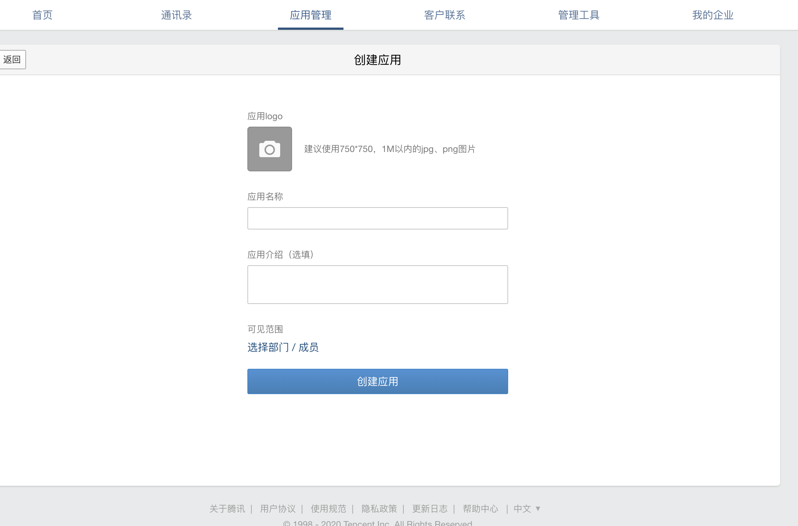
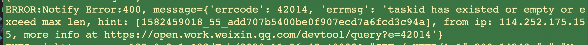

## 功能简介

    提供企业微信，通知发送功能, 可以完成日常机器人功能

## 环境配置
1. 申请企业微信，[企业微信申请地址](https://open.work.weixin.qq.com/api/doc)
2. 创建，第三方应用, [申请APP地址](https://work.weixin.qq.com/wework_admin/frame#apps)
    
3. 代码根目录中，创建`.env`文件
4. 在`.env`中配置参数
   ```shell
    CORPID=#填写自己的
    CORPSECRET=#填写自己的
    AGENTID=#申请应用的
   ```

5. 在其他地方，调用
    - title: 消息标题
    - description: 消息描述
    - task_id: **重要** 任务ID, 不能重复
    - touser: [] 通知的用户 
      - `@all` 是全部发送 **生产环境中慎用**
    - url: 自定义网址, 没有，可以不传
    
    其中，异常处理，使用`HttpBadRequest`类
    


    ```python

    from aiohttp.http_exceptions import HttpBadRequest
    from libs.wechat import Notify

    tpl = {'title': '服务器发骚中', 'description': '发骚中，需要重启',
            'task_id': 'task_6', 'url': 'https://www.baidu.com'}
    try:
        send_msg = await Notify().send_message(**tpl)
    except HttpBadRequest as e:
        web.logging.getLogger('Notify Error').error(e)
    ```

😄 **Have FUN , Fork It**

